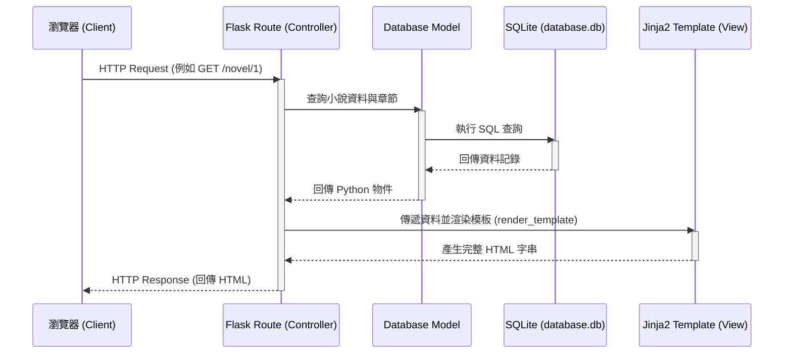

# 小說閱讀器系統 架構設計 (Architecture)

## 1. 技術架構說明

本專案採用經典的伺服器端渲染 (Server-Side Rendering, SSR) 架構，不進行前後端分離，以求快速開發與容易維護。

### 選用技術與原因
- **後端框架：Python + Flask**
  - **原因**：Flask 是輕量級的 Python Web 框架，適合快速打造雛型與中小型應用。學習曲線平緩，且能自由選擇所需擴充套件。
- **模板引擎：Jinja2**
  - **原因**：Flask 內建的模板引擎，能無縫整合 Python 變數與邏輯（如迴圈、條件判斷）到 HTML 頁面中，負責畫面渲染。
- **資料庫：SQLite (搭配 SQLAlchemy 或內建 sqlite3)**
  - **原因**：輕量級關聯式資料庫，無需額外安裝資料庫伺服器，資料儲存在單一檔案中，非常適合初期開發與個人專案。

### Flask MVC 模式說明
雖然 Flask 本身不強制規定 MVC，但我們將依循 MVC (Model-View-Controller) 的精神來組織程式碼：
- **Model (模型)**：負責與資料庫互動，定義資料表結構（例如：使用者、小說、章節、閱讀紀錄）。
- **View (視圖)**：由 Jinja2 HTML 模板負責，接收從 Controller 傳來的資料並呈現給使用者。
- **Controller (控制器)**：由 Flask 的路由 (Routes) 負責，接收瀏覽器的請求，呼叫 Model 處理業務邏輯與資料存取，最後將結果傳遞給 View 進行渲染。

## 2. 專案資料夾結構

建議的資料夾結構如下，以模組化的方式分離關注點：

```text
web_app_development2/
├── app/                      # 應用程式主目錄
│   ├── __init__.py           # Flask App 工廠函數與套件初始化
│   ├── models/               # 資料庫模型 (Model)
│   │   ├── __init__.py
│   │   ├── user.py           # 使用者模型
│   │   ├── novel.py          # 小說與章節模型
│   │   └── record.py         # 閱讀紀錄與收藏模型
│   ├── routes/               # 路由與控制器 (Controller)
│   │   ├── __init__.py
│   │   ├── auth.py           # 註冊、登入等驗證路由
│   │   ├── main.py           # 首頁、搜尋、排行榜路由
│   │   └── reader.py         # 小說閱讀、書單、紀錄路由
│   ├── templates/            # Jinja2 HTML 模板 (View)
│   │   ├── base.html         # 共用版面佈局 (Navbar, Footer)
│   │   ├── index.html        # 首頁 (熱門、分類)
│   │   ├── auth/             # 認證相關模板 (login, register)
│   │   └── novel/            # 小說相關模板 (list, detail, read)
│   └── static/               # 靜態資源
│       ├── css/              # 樣式表 (style.css)
│       ├── js/               # 前端腳本 (main.js)
│       └── images/           # 圖片資源 (封面等)
├── instance/                 # 放置不進入版控的環境變數與資料庫
│   └── database.db           # SQLite 資料庫檔案
├── docs/                     # 專案文件
│   ├── PRD.md                # 產品需求文件
│   └── ARCHITECTURE.md       # 架構設計文件 (本文件)
├── requirements.txt          # Python 依賴套件清單
└── run.py                    # 專案啟動入口腳本
```

## 3. 元件關係圖

以下是系統運作的元件關係圖，展示了從使用者發出請求到畫面回傳的完整流程：



## 4. 關鍵設計決策

1. **採用 Blueprint 模組化路由**
   - **決策**：將路由拆分為 `auth`, `main`, `reader` 等 Blueprint，而非全部寫在單一腳本裡。
   - **原因**：避免單一檔案過於龐大，提升程式碼可讀性與團隊協作效率。
2. **使用 ORM (如 SQLAlchemy) 操作資料庫**
   - **決策**：不直接寫原生 SQL 字串，而是透過 Python 類別 (Class) 與物件來操作資料。
   - **原因**：提高安全性（防範 SQL Injection），且物件導向操作更直覺，未來若需更換資料庫也相對容易。
3. **Session base 的使用者驗證**
   - **決策**：使用 Flask 內建的 Session (或 Flask-Login 套件) 來管理使用者登入狀態。
   - **原因**：對於 SSR 架構，Session 是最傳統且實作成本最低的方式，足以滿足 MVP 階段的需求。
4. **共用 Template Layout (繼承機制)**
   - **決策**：所有頁面模板（如 `index.html`, `detail.html`）都將繼承自 `base.html`。
   - **原因**：確保網站的導覽列 (Navbar) 與頁尾 (Footer) 風格一致，減少重複撰寫 HTML 代碼。
