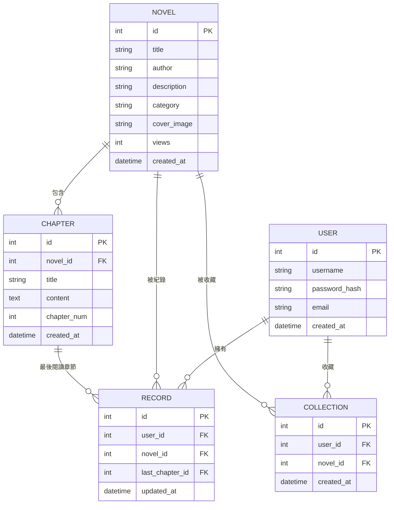

# 小說閱讀器系統 資料庫設計 (DB Design)

本文件定義了系統的資料模型、表結構以及 Python Model 的實作細節。

## 1. ER 圖 (Entity-Relationship Diagram)

使用 Mermaid 語法描述資料表之間的關聯。



## 2. 資料表詳細說明

### USER (使用者)
- `id`: INTEGER PRIMARY KEY AUTOINCREMENT
- `username`: TEXT, UNIQUE, NOT NULL (登入帳號)
- `password_hash`: TEXT, NOT NULL (雜湊後的密碼)
- `email`: TEXT, UNIQUE, NOT NULL
- `created_at`: DATETIME, DEFAULT CURRENT_TIMESTAMP

### NOVEL (小說)
- `id`: INTEGER PRIMARY KEY AUTOINCREMENT
- `title`: TEXT, NOT NULL (書名)
- `author`: TEXT, NOT NULL (作者)
- `description`: TEXT (簡介)
- `category`: TEXT (分類)
- `cover_image`: TEXT (封面圖片路徑或 URL)
- `views`: INTEGER, DEFAULT 0 (點擊數/觀看數)
- `created_at`: DATETIME, DEFAULT CURRENT_TIMESTAMP

### CHAPTER (章節)
- `id`: INTEGER PRIMARY KEY AUTOINCREMENT
- `novel_id`: INTEGER, FOREIGN KEY (所屬小說)
- `title`: TEXT, NOT NULL (章節標題)
- `content`: TEXT, NOT NULL (章節內容)
- `chapter_num`: INTEGER, NOT NULL (章節序號)
- `created_at`: DATETIME, DEFAULT CURRENT_TIMESTAMP

### RECORD (閱讀紀錄)
- `id`: INTEGER PRIMARY KEY AUTOINCREMENT
- `user_id`: INTEGER, FOREIGN KEY (使用者)
- `novel_id`: INTEGER, FOREIGN KEY (小說)
- `last_chapter_id`: INTEGER, FOREIGN KEY (最後閱讀章節)
- `updated_at`: DATETIME, DEFAULT CURRENT_TIMESTAMP

### COLLECTION (收藏書單)
- `id`: INTEGER PRIMARY KEY AUTOINCREMENT
- `user_id`: INTEGER, FOREIGN KEY (使用者)
- `novel_id`: INTEGER, FOREIGN KEY (小說)
- `created_at`: DATETIME, DEFAULT CURRENT_TIMESTAMP

## 3. SQL 建表語法 (database/schema.sql)

```sql
-- 使用者表
CREATE TABLE IF NOT EXISTS users (
    id INTEGER PRIMARY KEY AUTOINCREMENT,
    username TEXT UNIQUE NOT NULL,
    password_hash TEXT NOT NULL,
    email TEXT UNIQUE NOT NULL,
    created_at DATETIME DEFAULT CURRENT_TIMESTAMP
);

-- 小說表
CREATE TABLE IF NOT EXISTS novels (
    id INTEGER PRIMARY KEY AUTOINCREMENT,
    title TEXT NOT NULL,
    author TEXT NOT NULL,
    description TEXT,
    category TEXT,
    cover_image TEXT,
    views INTEGER DEFAULT 0,
    created_at DATETIME DEFAULT CURRENT_TIMESTAMP
);

-- 章節表
CREATE TABLE IF NOT EXISTS chapters (
    id INTEGER PRIMARY KEY AUTOINCREMENT,
    novel_id INTEGER NOT NULL,
    title TEXT NOT NULL,
    content TEXT NOT NULL,
    chapter_num INTEGER NOT NULL,
    created_at DATETIME DEFAULT CURRENT_TIMESTAMP,
    FOREIGN KEY (novel_id) REFERENCES novels (id) ON DELETE CASCADE
);

-- 閱讀紀錄表
CREATE TABLE IF NOT EXISTS records (
    id INTEGER PRIMARY KEY AUTOINCREMENT,
    user_id INTEGER NOT NULL,
    novel_id INTEGER NOT NULL,
    last_chapter_id INTEGER,
    updated_at DATETIME DEFAULT CURRENT_TIMESTAMP,
    FOREIGN KEY (user_id) REFERENCES users (id) ON DELETE CASCADE,
    FOREIGN KEY (novel_id) REFERENCES novels (id) ON DELETE CASCADE,
    FOREIGN KEY (last_chapter_id) REFERENCES chapters (id)
);

-- 收藏表
CREATE TABLE IF NOT EXISTS collections (
    id INTEGER PRIMARY KEY AUTOINCREMENT,
    user_id INTEGER NOT NULL,
    novel_id INTEGER NOT NULL,
    created_at DATETIME DEFAULT CURRENT_TIMESTAMP,
    FOREIGN KEY (user_id) REFERENCES users (id) ON DELETE CASCADE,
    FOREIGN KEY (novel_id) REFERENCES novels (id) ON DELETE CASCADE
);
```

## 4. Python Model 實作

各 Model 的 Python 實作已分別建立於 `app/models/` 資料夾中。
