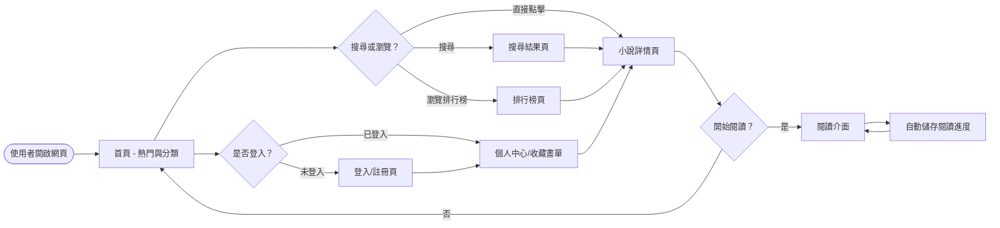
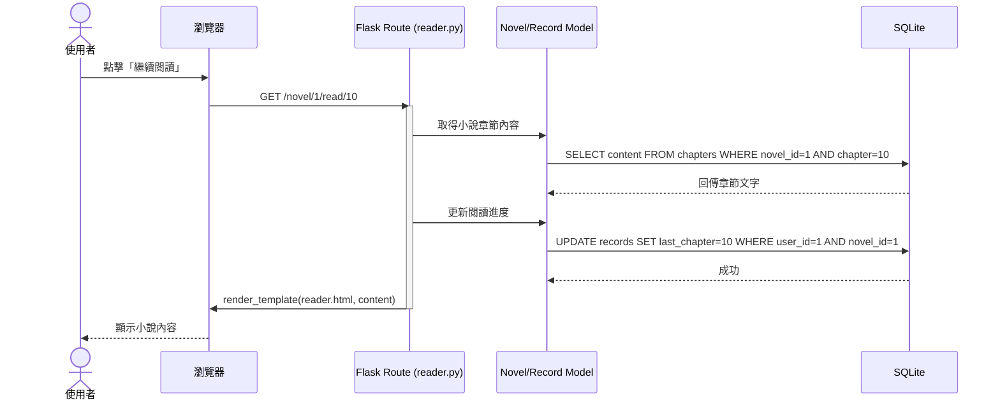

# 小說閱讀器系統 流程圖設計 (Flowchart)

本文件描述了使用者的操作流程以及系統內部的資料流向，幫助開發團隊理解功能邏輯。

## 1. 使用者流程圖 (User Flow)

描述讀者從進入網站到完成閱讀或管理書單的操作路徑。

## 2. 系統序列圖 (Sequence Diagram)

描述「使用者點擊閱讀小說」到「系統讀取內容並紀錄進度」的完整流程。

## 3. 功能清單對照表

以下為系統主要功能的 URL 路徑與對應的 HTTP 方法。

| 功能名稱 | URL 路徑 | HTTP 方法 | 說明 |
|---|---|---|---|
| 首頁 | `/` | GET | 顯示熱門小說與分類入口 |
| 登入 | `/auth/login` | GET/POST | 顯示登入頁面與處理登入邏輯 |
| 註冊 | `/auth/register` | GET/POST | 顯示註冊頁面與處理註冊邏輯 |
| 搜尋 | `/search` | GET | 根據關鍵字搜尋小說 |
| 排行榜 | `/ranking` | GET | 顯示各分類的小說排行 |
| 小說詳情 | `/novel/<id>` | GET | 顯示小說簡介、章節列表 |
| 閱讀介面 | `/novel/<id>/read/<chapter>` | GET | 閱讀特定章節內容 |
| 收藏小說 | `/novel/<id>/collect` | POST | 將小說加入使用者的收藏清單 |
| 個人紀錄 | `/profile` | GET | 顯示使用者的閱讀紀錄與收藏書單 |
